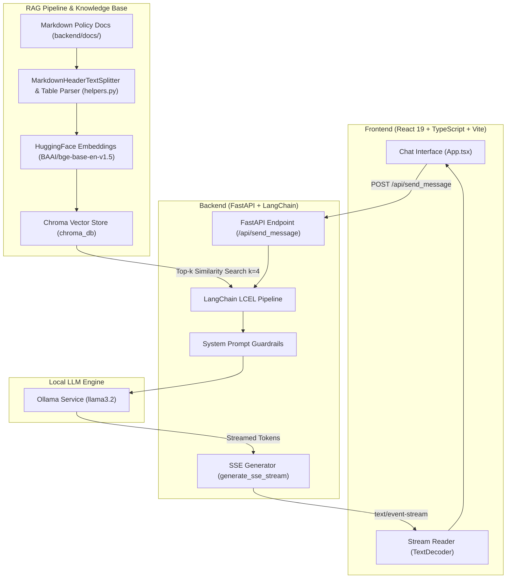

# HR Assistant & Company Policy Chatbot

An enterprise-grade Retrieval-Augmented Generation (RAG) HR Assistant application designed to strictly answer employee questions based on company policy documents. Built with **FastAPI**, **LangChain**, **ChromaDB**, **Ollama (`llama3.2`)**, **HuggingFace (`bge-base-en-v1.5`)**, and a **React 19 + TypeScript + Vite + Tailwind CSS** frontend with real-time SSE streaming.

---

## 🏗️ Architecture Overview

The system uses a decoupled client-server architecture with a local RAG pipeline ensuring zero data leakage and strict prompt guardrails.



---

## 🛠️ Tech Stack

### **Backend**
- **Framework**: [FastAPI](https://fastapi.tiangolo.com/) (Asynchronous python web framework)
- **RAG Orchestration**: [LangChain](https://www.langchain.com/) / LangChain Core / LangChain Community
- **LLM**: [Ollama](https://ollama.com/) running **`llama3.2`** (local inference)
- **Embedding Model**: `BAAI/bge-base-en-v1.5` via `langchain-huggingface`
- **Vector Database**: [ChromaDB](https://www.trychroma.com/) (`langchain-chroma`)
- **Server / Streaming**: Uvicorn, Server-Sent Events (SSE via `StreamingResponse`)

### **Frontend**
- **Framework**: [React 19](https://react.dev/) + [TypeScript](https://www.typescriptlang.org/)
- **Build Tool**: [Vite](https://vitejs.dev/)
- **Styling**: [Tailwind CSS v4](https://tailwindcss.com/)
- **Icons**: [Lucide React](https://lucide.dev/)

---

## ⚡ RAG Ingestion & Guardrails Strategy

1. **Structured Chunking & Table Processing (`helpers.py`)**:
   - Documents in `backend/docs/` are split by markdown headers (`#` and `##`).
   - Extract metadata including document title, version, owner, and `applies_to` target audience.
   - Converts Markdown tables into readable Key-Value string structures to improve vector search recall for complex tabular policy rules.
2. **Vector Retrieval (`chat.py`)**:
   - Embeds policy chunks using HuggingFace's GPU-accelerated `BAAI/bge-base-en-v1.5` embeddings.
   - Retrieves top 4 relevant chunks from ChromaDB for each query.
3. **Strict System Prompt Enforcement**:
   - Answers strictly from provided context.
   - Falls back gracefully to `"I don't have enough information; please contact HR."` when policy context is insufficient.
   - Out-of-domain queries (e.g. general knowledge) are politely refused: `"I can only answer questions related to company policies."`
   - Handles greetings and self-capability questions without polluting vector context.

---

## 🚀 How to Run on Local Machine

### **Prerequisites**

Ensure you have the following installed on your machine:
- **Python**: `3.10` or higher
- **Node.js**: `18.0` or higher (with `npm`)
- **Ollama**: Download and install from [ollama.com](https://ollama.com/)
- *(Optional)* **NVIDIA GPU** with CUDA support for accelerated embedding generation.

---

### **Step 1: Setup & Start Ollama**

1. Install and start the Ollama service on your machine.
2. Pull the required `llama3.2` model:
   ```bash
   ollama pull llama3.2
   ```
3. Keep Ollama running in the background.

---

### **Step 2: Backend Setup & Data Ingestion**

1. Navigate to the `backend` directory:
   ```bash
   cd backend
   ```

2. Create and activate a Python virtual environment:
   - **Windows (PowerShell):**
     ```powershell
     python -m venv .venv
     .\.venv\Scripts\Activate.ps1
     ```
   - **Linux / macOS:**
     ```bash
     python3 -m venv .venv
     source .venv/bin/activate
     ```

3. Install the required Python packages:
   ```bash
   pip install -r requirements.txt
   ```

4. **Ingest & Index Documents** into ChromaDB:
   ```bash
   python helpers.py
   ```
   *(This will process all `.md` policy files in `backend/docs/` and generate the vector embeddings in `./chroma_db`)*

5. **Start the FastAPI Backend Server**:
   ```bash
   python main.py
   ```
   *The backend server will run at:* `http://127.0.0.1:8000`

---

### **Step 3: Frontend Setup & Execution**

1. Open a new terminal window and navigate to the `frontend` directory:
   ```bash
   cd frontend
   ```

2. Install Node.js dependencies:
   ```bash
   npm install
   ```

3. Start the Vite development server:
   ```bash
   npm run dev
   ```

4. Open your browser and open the URL displayed in the terminal (typically `http://localhost:5173`).

---

## 📁 Project Directory Structure

```
Placement/
├── README.md                      # Project architecture & local setup documentation
├── backend/
│   ├── main.py                    # FastAPI app entry point & SSE stream endpoint
│   ├── chat.py                    # LangChain LCEL chain, Chroma retriever & SSE generator
│   ├── helpers.py                 # Markdown chunker, table formatter & indexer script
│   ├── requirements.txt           # Backend Python dependencies
│   ├── chroma_db/                 # Persisted Chroma vector database
│   └── docs/                      # Company policy markdown documents
│       ├── benefits-policy.md
│       ├── it-security-policy.md
│       └── leave-policy.md
└── frontend/
    ├── package.json               # Node.js dependencies and script commands
    ├── vite.config.ts             # Vite configuration
    ├── index.html                 # App HTML template
    └── src/
        ├── App.tsx                # Main Chat UI component & SSE streaming logic
        ├── App.css
        ├── index.css              # Tailwind CSS styling
        └── main.tsx               # React DOM entry point
```

---

## 📡 API Reference

### **POST** `/api/send_message`

Sends a query to the HR assistant and streams the generated response token by token via Server-Sent Events (SSE).

- **Request Body:**
  ```json
  {
    "message": "What is the policy for annual leave?"
  }
  ```

- **Response:** `text/event-stream`
  ```http
  HTTP/1.1 200 OK
  Content-Type: text/event-stream
  Cache-Control: no-cache

  data: {"token": "Full"} <end>
  data: {"token": "-time"} <end>
  data: {"token": " employees"} <end>
  ...
  data:<DONE><end>
  ```
