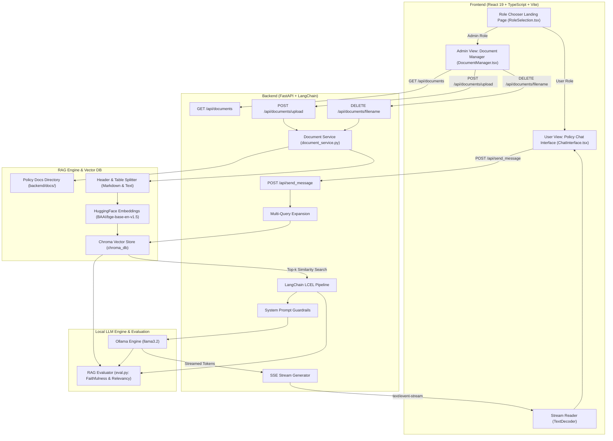

# HR Assistant & Company Policy RAG Platform

An enterprise-grade, local **Retrieval-Augmented Generation (RAG)** HR Assistant platform that enables employees to query company policy documents while providing administrators with document management capabilities.

Built with **FastAPI**, **LangChain**, **ChromaDB**, **Ollama (`llama3.2`)**, **HuggingFace (`bge-base-en-v1.5`)**, and a **React 19 + TypeScript + Vite + Tailwind CSS** frontend featuring role-based access (User vs. Admin), dynamic document upload & chunking, vector DB index management, automated RAG evaluation (`eval.py`), and real-time SSE token streaming.

---

## 🏗️ Architecture Overview

The platform uses a decoupled client-server architecture with a local RAG pipeline ensuring zero data leakage and strict prompt guardrails.



---

## ✨ Key Features & Capability Matrix

| Feature | User Role | Admin Role | Description |
| :--- | :---: | :---: | :--- |
| **Role Chooser Landing Page** | ✅ | ✅ | Starting page allowing instant selection between User and Admin roles. |
| **Policy Chatbot** | ✅ | ✅ | Query company policies with streaming answers backed by RAG context. |
| **Document Upload** | ❌ | ✅ | Upload `.md` or `.txt` policy files. Automatically chunks and embeds into Chroma DB. |
| **Document Deletion** | ❌ | ✅ | Delete obsolete policy documents from server disk and purge vectors from Chroma DB. |
| **Vector Chunks Tracker** | ❌ | ✅ | Live view of uploaded files, file sizes, and chunk counts stored in Chroma DB. |
| **Multi-Query Retrieval** | ✅ | ✅ | Decomposes complex user queries into subqueries for broader vector search recall. |
| **Automated RAG Evaluation** | — | — | Run `eval.py` to evaluate Faithfulness & Relevancy using LLM-as-a-Judge. |

---

## 🛠️ Tech Stack

### **Backend**
- **Framework**: [FastAPI](https://fastapi.tiangolo.com/) (Async Python API web framework)
- **RAG Orchestration**: [LangChain](https://www.langchain.com/) (LangChain Core, LangChain Community)
- **Local LLM**: [Ollama](https://ollama.com/) running **`llama3.2`** (Offline local inference)
- **Embedding Model**: `BAAI/bge-base-en-v1.5` via `langchain-huggingface`
- **Vector Database**: [ChromaDB](https://www.trychroma.com/) (`langchain-chroma`)
- **Evaluation**: Custom LLM-as-a-Judge metric pipeline using Pydantic structured output parsers (`eval.py`)

### **Frontend**
- **Framework**: [React 19](https://react.dev/) + [TypeScript](https://www.typescriptlang.org/)
- **Build Tool**: [Vite](https://vitejs.dev/)
- **Styling**: [Tailwind CSS v4](https://tailwindcss.com/)
- **Icons**: [Lucide React](https://lucide.dev/)

---

## ⚡ RAG Pipeline, Ingestion & Evaluation Strategy

1. **Dynamic Document Upload & Chunking (`document_service.py`)**:
   - Admin uploads `.md` or `.txt` policy files via the frontend or API.
   - Markdown documents are split by structural headers (`#`, `##`) using `MarkdownHeaderTextSplitter`. Plain text documents fall back to `RecursiveCharacterTextSplitter`.
   - Markdown tables are converted into Key-Value dictionary lines to ensure vector embeddings maintain exact row/column tabular semantics.
   - Metadata is attached to every chunk (`source`: filename, `document_title`, `section`, `applies_to`, `version`, `owner`).

2. **Chroma Vector Store Indexing**:
   - Embeds text chunks using HuggingFace's `BAAI/bge-base-en-v1.5` model.
   - Chunks are stored in Chroma vector collection `company_policies`.
   - Document deletion automatically removes the file from `backend/docs/` and executes `vector_store._collection.delete(where={"source": filename})` to purge vector embeddings.

3. **Multi-Query Retrieval & Guardrails (`chat.py`)**:
   - Complex inquiries are expanded into 1-4 targeted sub-queries via LLM decomposition before performing vector retrieval.
   - Answers strictly adhere to policy context. Out-of-scope or general knowledge questions are refused: `"I can only answer questions related to company policies."`

4. **Automated RAG Evaluation Framework (`eval.py`)**:
   - Evaluates the RAG system performance across two key metrics:
     - **Faithfulness**: Checks if generated answers are strictly grounded in retrieved policy context blocks.
     - **Answer Relevancy**: Evaluates how directly the answer addresses the user prompt without redundant fluff.
   - Outputs structured JSON evaluation objects containing a numerical score (`0.0` to `1.0`) and detailed reasoning.

---

## 🚀 How to Run on Your Own Machine

Follow these step-by-step instructions to clone, set up, and run the HR Assistant application locally.

### **Prerequisites**

Ensure your system has the following software installed:
- **Git**: [git-scm.com](https://git-scm.com/)
- **Python**: `3.10` or higher ([python.org](https://www.python.org/))
- **Node.js**: `18.0` or higher (with `npm`) ([nodejs.org](https://nodejs.org/))
- **Ollama**: Download and install from [ollama.com](https://ollama.com/)
- *(Optional)* **NVIDIA GPU** with CUDA support for fast embedding generation and local inference.

---

### **Step 1: Clone the Repository**

Open a terminal or PowerShell prompt and run:

```bash
git clone https://github.com/milansamanta/HR_Assistant.git
cd HR_Assistant
```

---

### **Step 2: Install & Run Ollama**

1. Install Ollama from [ollama.com](https://ollama.com/).
2. Start the Ollama application / service on your system.
3. Open a terminal and pull the required `llama3.2` model:
   ```bash
   ollama pull llama3.2
   ```
4. Verify Ollama is working by running:
   ```bash
   ollama list
   ```
   *(You should see `llama3.2` listed in the output. Keep Ollama running in the background).*

---

### **Step 3: Setup & Launch Backend (FastAPI)**

1. Navigate to the `backend` directory:
   ```bash
   cd backend
   ```

2. Create and activate a Python virtual environment:
   - **Windows (PowerShell):**
     ```powershell
     python -m venv .venv
     .\.venv\Scripts\Activate.ps1
     ```
   - **Linux / macOS:**
     ```bash
     python3 -m venv .venv
     source .venv/bin/activate
     ```

3. Install backend Python dependencies:
   ```bash
   pip install -r requirements.txt
   ```

4. *(Optional)* Run initial document indexing manually:
   ```bash
   python helpers.py
   ```
   *(Note: `main.py` automatically checks and indexes any unindexed files in `backend/docs/` upon server startup).*

5. **Start the FastAPI Backend Server**:
   ```bash
   python main.py
   ```
   *The API server will start at:* `http://127.0.0.1:8000`

---

### **Step 4: (Optional) Run RAG Evaluation Metrics**

In a separate terminal (with virtual environment activated in `backend/`), run the evaluation script:

```bash
python eval.py
```

This script will run test policy queries, retrieve context, generate answers, and output structured **Faithfulness** and **Relevancy** scores with reasoning via `llama3.2`.

---

### **Step 5: Setup & Launch Frontend (React 19 + Vite)**

1. Open a new terminal window and navigate to the `frontend` directory:
   ```bash
   cd frontend
   ```

2. Install Node.js dependencies:
   ```bash
   npm install
   ```

3. Start the Vite frontend development server:
   ```bash
   npm run dev
   ```

4. Open your browser and navigate to `http://localhost:5173` (or the URL displayed in terminal).

---

### **Step 6: Use the App**

1. **Role Chooser Landing Page**: On startup, select **User** or **Admin**.
2. **User Mode**:
   - Access the clean policy chat interface.
   - Ask questions like *"What are the health coverage tiers?"* or *"What is the leave policy?"*.
3. **Admin Mode**:
   - Navigate between **Document Upload & Delete** and **Policy Chat Test**.
   - **Upload**: Select a `.md` or `.txt` policy document to automatically chunk and store vectors into Chroma DB.
   - **Delete**: Remove obsolete policy files from the server and purge their embeddings from Chroma DB.

---

## 📁 Project Directory Structure

```
HR_Assistant/
├── README.md                      # Project architecture & setup documentation
├── backend/
│   ├── main.py                    # FastAPI app entry point & endpoints (/api/send_message, /api/documents)
│   ├── chat.py                    # Multi-query RAG chain, Chroma retriever & SSE streaming
│   ├── document_service.py        # Document upload, chunking, deleting & Chroma vector store manager
│   ├── helpers.py                 # Markdown header chunking, table formatter & metadata extractor
│   ├── eval.py                    # RAG evaluation pipeline (Faithfulness & Relevancy LLM-as-a-Judge)
│   ├── requirements.txt           # Backend Python dependencies
│   ├── chroma_db/                 # Persisted Chroma vector database directory
│   └── docs/                      # Company policy markdown documents repository
│       ├── benefits-policy.md
│       ├── it-security-policy.md
│       └── leave-policy.md
└── frontend/
    ├── package.json               # Node.js dependencies & scripts
    ├── vite.config.ts             # Vite configuration
    ├── index.html                 # Main HTML template
    └── src/
        ├── App.tsx                # Main App component with role router & navigation
        ├── index.css              # Global styles & Tailwind CSS v4 setup
        ├── main.tsx               # React DOM entry point
        └── components/
            ├── RoleSelection.tsx  # Starting page for choosing User or Admin role
            ├── ChatInterface.tsx  # Reusable policy chat component with SSE streaming
            └── DocumentManager.tsx# Admin document management (Upload, Chunk, List, Delete)
```

---

## 📡 API Endpoints Reference

| Endpoint | Method | Role | Description |
| :--- | :---: | :---: | :--- |
| `/api/send_message` | `POST` | User / Admin | Sends user query and streams LLM answer via Server-Sent Events (SSE). |
| `/api/documents` | `GET` | Admin | Returns JSON list of stored documents, file sizes, and Chroma DB chunk counts. |
| `/api/documents/upload` | `POST` | Admin | Uploads a `.md` or `.txt` file, chunks content, and embeds into Chroma DB. |
| `/api/documents/{filename}`| `DELETE` | Admin | Deletes document file from server disk and purges vector chunks from Chroma DB. |

---

### **Sample SSE Request / Response**

`POST /api/send_message`

**Request Payload:**
```json
{
  "message": "What is the annual sum insured for Band B health tier?"
}
```

**Response (`text/event-stream`):**
```http
HTTP/1.1 200 OK
Content-Type: text/event-stream
Cache-Control: no-cache

data: {"token": "For "} <end>
data: {"token": "Band "} <end>
data: {"token": "B, "} <end>
data: {"token": "the "} <end>
data: {"token": "annual "} <end>
data: {"token": "sum "} <end>
data: {"token": "insured "} <end>
data: {"token": "is "} <end>
data: {"token": "₹5,00,000 "} <end>
...
data:<DONE><end>
```
